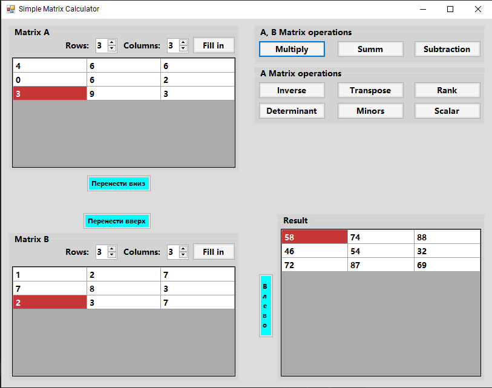
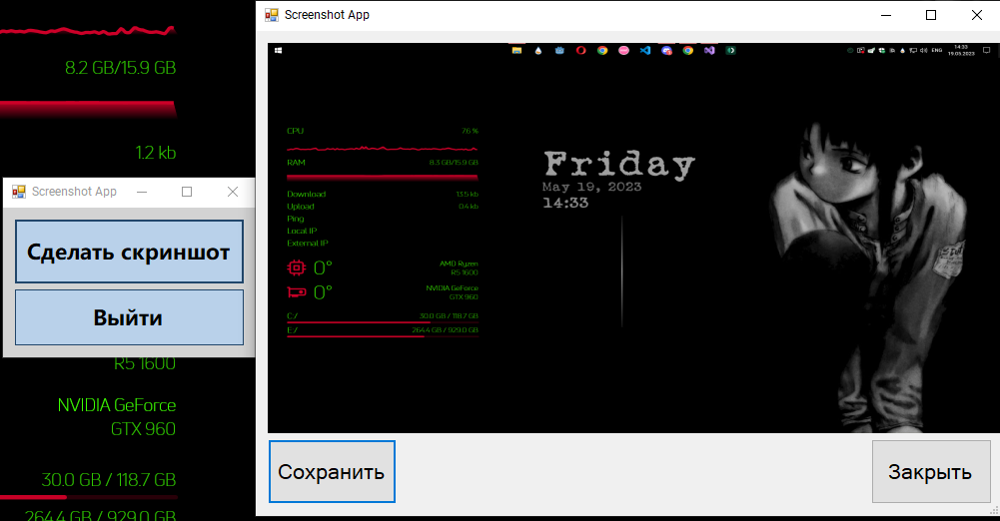
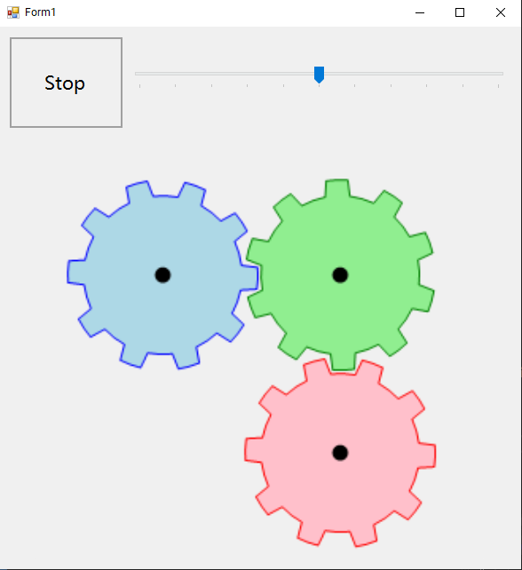
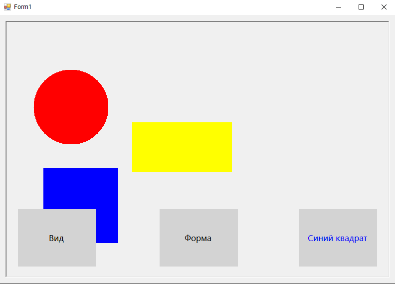
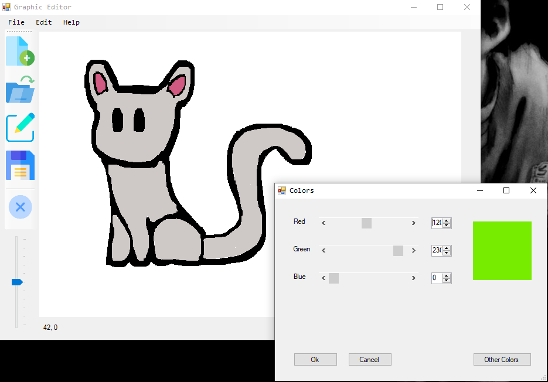
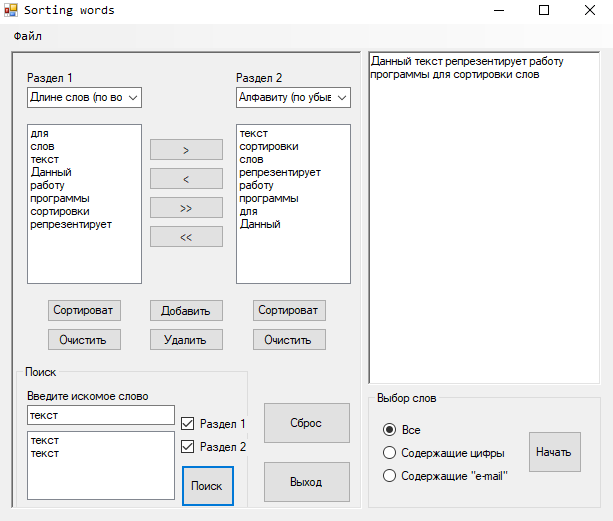

# PracticalWorkOnProgramming
    Все работы находятся в одном решении
__Далее будет приведено краткое описание для каждой выполненной работы:__
- __Simple Matrix Calculator__ - 
    Простой матричный калькулятор, выполняет базовые функции над одной или двумя матрицами
    
- __Screenshot App__ -
    Программа для скриншотов экрана
    
- __Image Animation App__ -
    Программа для анимации ряда последовательных изображений 
    
- __Drag Graphic Objects App__ - 
    Программа, демонстрирующая передвижение графических элементов при помощи мыши 
    
- __Simple Graphic Editor__ - 
    Простой текстовый редактор для работы с изображениями. Данная программа - результат двух практических работ 
    
- __Sorting Words App__ - 
    Программа для сортировки слов различными методами
    
